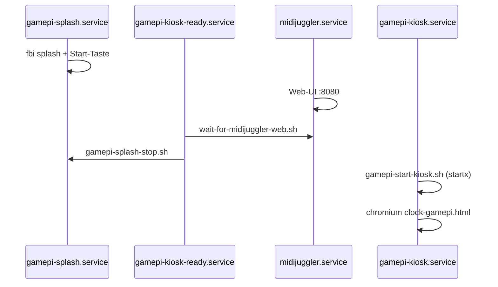

# GamePi — Deploy nach git pull

Kurzanleitung für GamePi13 mit MIDIJuggler unter `/opt/midijuggler/app`.

Der Kiosk nutzt wieder den **einfachen Ablauf**: Splash auf fbdev → Web-UI warten →
`splash-stop` → `startx` mit `gamepi-start-kiosk.sh` → Chromium auf
`clock-gamepi.html`.

## Voraussetzungen

| Was | Pfad |
|-----|------|
| App-Checkout | `/opt/midijuggler/app` |
| Python-venv | `/opt/midijuggler/venv` |
| Konfiguration | `/etc/midijuggler/config.toml` |

Einmalig (neues Image): siehe [`gamepi13.md`](gamepi13.md).

## Deploy (empfohlen)

```bash
cd /opt/midijuggler/app
sudo ./scripts/deploy-gamepi.sh
```

Das Skript ist idempotent. Standard: **Kiosk bleibt laufen** (`GAMEPI_RESTART_KIOSK=0`).

### Was passiert

1. `pull-midijuggler-app.sh` — holt `origin/main`
2. `pip install -e ".[alsa,midi,hid,rotary]"`
3. `midijuggler.service` + sudoers
4. `install-gamepi13-services.sh` — Units und Skripte
5. `gamepi-reload-after-pull.sh` — `midijuggler` neu starten, Kiosk optional

## Nur App-Update (ohne Kiosk-Neustart)

```bash
sudo MIDIJUGGLER_SKIP_GIT_PULL=0 GAMEPI_RELOAD_KIOSK=0 \
  /opt/midijuggler/app/scripts/gamepi-reload-after-pull.sh
```

Web-UI und Tempo-Anzeige aktualisieren sich; der laufende Chromium-Kiosk bleibt.

## Kiosk neu starten

```bash
sudo GAMEPI_RELOAD_KIOSK=1 \
  /opt/midijuggler/app/scripts/gamepi-reload-after-pull.sh
```

Oder vollständiger Deploy mit Kiosk-Neustart:

```bash
sudo GAMEPI_RESTART_KIOSK=1 /opt/midijuggler/app/scripts/deploy-gamepi.sh
```

## Verifikation

```bash
git -C /opt/midijuggler/app rev-parse --short HEAD
systemctl is-active midijuggler.service
systemctl is-active gamepi-kiosk.service
curl -fsS http://127.0.0.1:8080/static/clock-gamepi.html -o /dev/null && echo ok
/opt/midijuggler/app/scripts/gamepi-display-health.sh && echo display ok
cat /sys/class/graphics/fb0/blank   # 0 = Panel an
```

## Boot-Ablauf



## Bei schwarzem Bildschirm

```bash
sudo /opt/midijuggler/app/scripts/gamepi-recover-display.sh
sudo reboot
```

## Rollback-Hinweis

GamePi-Kiosk-Skripte und systemd-Units wurden auf den Stand von **e5d37dd**
zurückgesetzt (vor der setterm/blanking-Regression). Die Tempo-Anzeige in
`clock-gamepi.html` und die Web-UI-Fixes bleiben erhalten.
